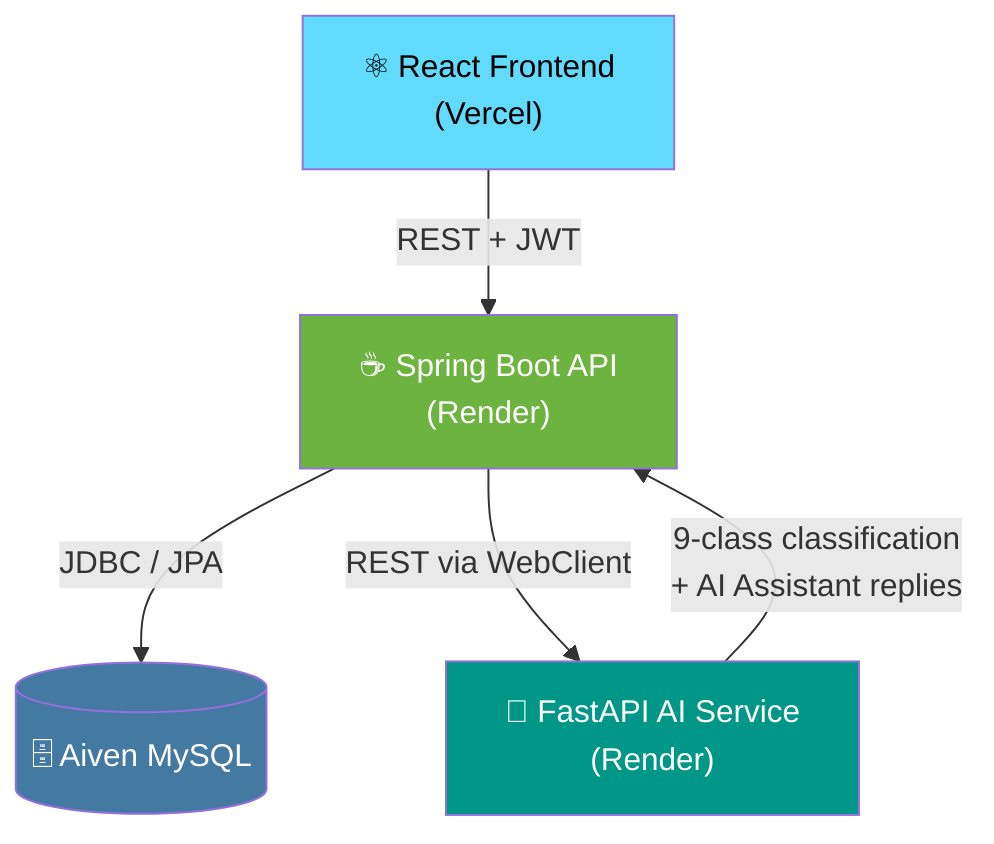
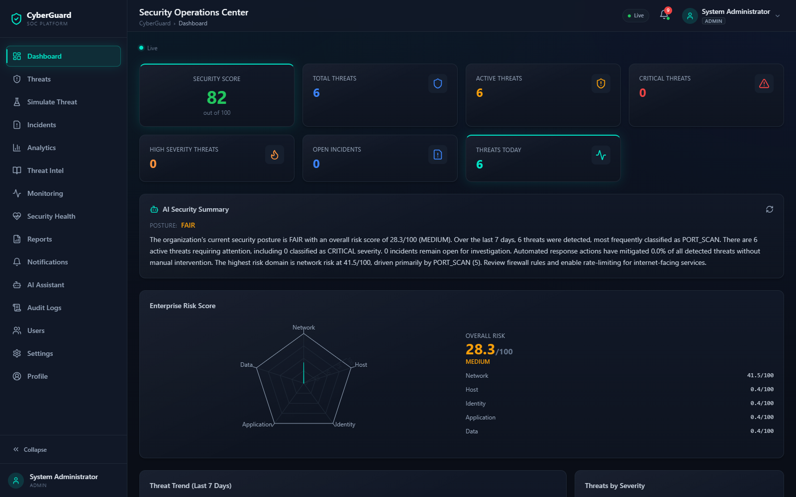
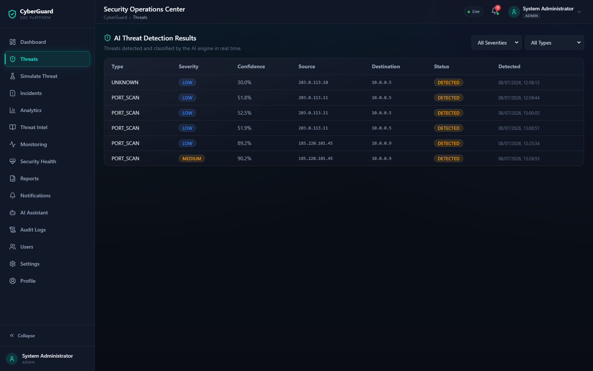
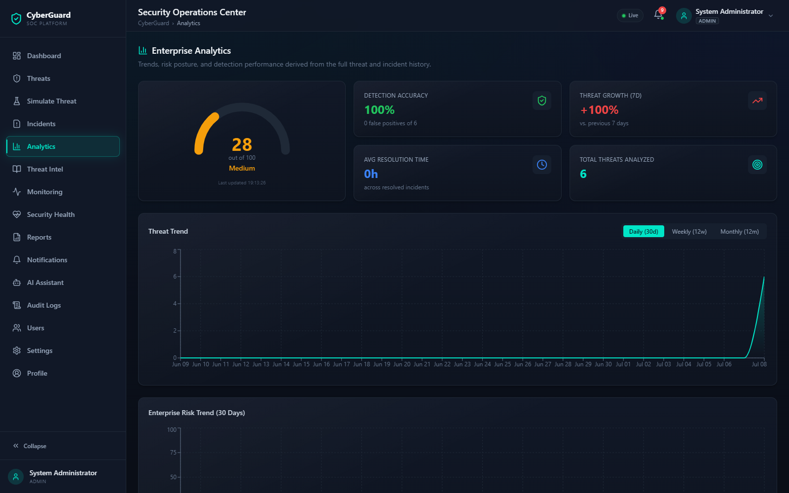
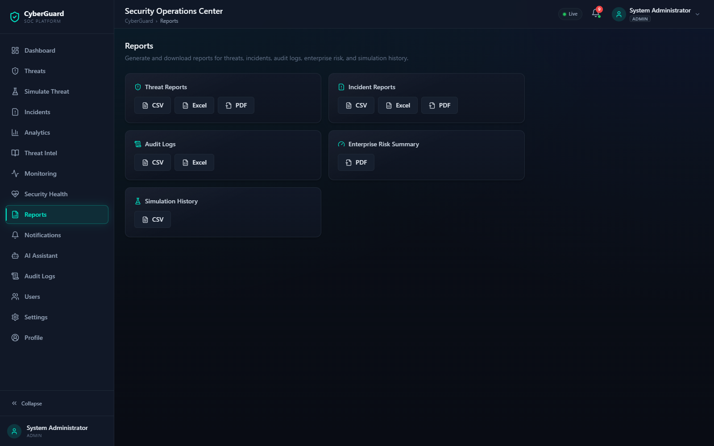
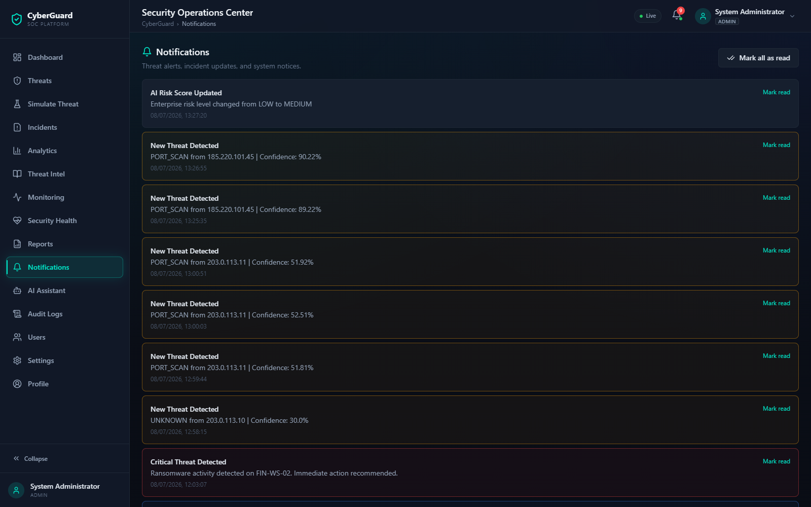
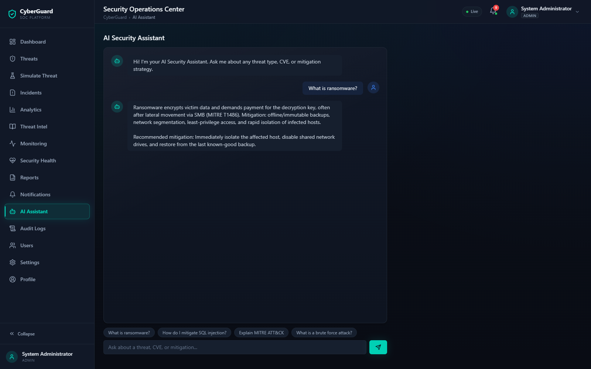

<div align="center">

# 🛡️ CyberGuard
### AI-Based Cyber Threat Detection & Incident Response Platform

*An enterprise-grade Security Operations Center (SOC) platform combining real-time monitoring,*
*AI-powered threat detection, threat intelligence, automated incident response, and an AI security assistant*
*into a single centralized dashboard.*

[](https://github.com/poojaaxx/AI-Based-Cyber-Threat-Detection-and-Incident-Response-Platform/commits/main)
[](https://github.com/poojaaxx/AI-Based-Cyber-Threat-Detection-and-Incident-Response-Platform)
[](#-license)

[](#)
[](#)
[](#)
[](#)
[](#)
[](#)
[](#)
[](#)
[](#)
[](#)

<!--
  🎬 Demo video / GIF placeholder.
  Record a short walkthrough (login → dashboard → threat simulation → AI assistant)
  and drop it in docs/media/demo.gif, then uncomment the line below.

  
-->

</div>

---

## 🚀 Live Demo

<div align="center">

[](https://ai-based-cyber-threat-detection-and.vercel.app)
[](https://ai-based-cyber-threat-detection-and.onrender.com/swagger-ui.html)
[](https://cyberguard-ai-service-84vt.onrender.com/docs)
[](https://github.com/poojaaxx/AI-Based-Cyber-Threat-Detection-and-Incident-Response-Platform)

**Demo login:** `admin` / `Password@123`

</div>

> ⚠️ Backend and AI service run on Render's free tier, which spins down after ~15 minutes of
> inactivity. The **first** request after idle time may take 30–60 seconds to wake up — this is
> expected, not a bug.

---

## 📑 Table of Contents

- [Features](#-features)
- [Architecture](#-architecture)
- [Tech Stack](#-tech-stack)
- [Screenshots](#-screenshots)
- [Installation](#-installation)
- [Environment Variables](#-environment-variables)
- [API Documentation](#-api-documentation)
- [Deployment](#-deployment)
- [Project Highlights](#-project-highlights)
- [Future Enhancements](#-future-enhancements)
- [License](#-license)

---

## ✨ Features

| | | |
|---|---|---|
| 🧠 **AI-Powered Threat Detection** | 🚨 **Automated Incident Response** | 🔐 **JWT Authentication** |
| 👥 **Role-Based Access Control** | 🕵️ **Threat Intelligence** (CVE / IOC / MITRE ATT&CK) | 📊 **Security Dashboard** |
| 📄 **Reports** (PDF / CSV / Excel) | 🔔 **Real-Time Notifications** | 💬 **AI Security Assistant** |
| 📈 **Visual Analytics** | 🐳 **Docker Deployment** | ☁️ **Cloud Deployment** |

<details>
<summary><strong>📋 Full module breakdown</strong> (click to expand)</summary>

1. **Authentication** — JWT access/refresh tokens, RBAC (Admin / Security Analyst / User)
2. **Dashboard** — security score, active threats, statistics, trends, recent activity
3. **Real-Time Monitoring** — system logs, login attempts, network events
4. **AI Threat Detection** — 9-class RandomForest classifier (malware, DDoS, SQL injection,
   XSS, brute force, port scan, phishing, ransomware, insider threat)
5. **Threat Classification** — Low / Medium / High / Critical severity
6. **Threat Intelligence** — CVE database, IOC feed, MITRE ATT&CK mapping
7. **Automated Incident Response** — block IP, disable user, quarantine threat, notify admin
8. **AI Security Assistant** — chat-based threat/CVE explanations and mitigation guidance
9. **Incident Management** — create, assign, update, resolve, timeline, comments
10. **Reports** — PDF, CSV, Excel export
11. **Notifications** — dashboard + email alerts for critical threats
12. **Visual Analytics** — line/pie/bar charts, threat & incident trends
13. **Audit Logs** — full action trail
14. **Settings** — profile, password, notification preferences, API configuration

</details>

---

## 🏗️ Architecture



The React SPA talks only to the Spring Boot API (never directly to the AI service or database).
The backend owns all persistence via JPA/MySQL and delegates threat classification + assistant
replies to the FastAPI microservice over REST, with a graceful heuristic fallback if that service
is temporarily unreachable.

---

## 🧰 Tech Stack

| Layer | Technology |
|---|---|
| **Frontend** | React 18 (Vite), React Router, Axios, Tailwind CSS, Recharts |
| **Backend** | Spring Boot 3.2.5, Spring Web, Spring Data JPA, Maven |
| **AI Service** | Python 3.11, FastAPI, scikit-learn, Pandas, NumPy |
| **Database** | MySQL 8 (Aiven managed, in production) |
| **Authentication** | Spring Security + JWT (access + refresh tokens), BCrypt password hashing |
| **Deployment** | Docker (all three services), Vercel (frontend), Render (backend + AI service) |
| **Containerization** | Multi-stage Dockerfiles per service + Docker Compose for local parity |

---

## 📸 Screenshots

> Captured directly from the live deployed app at
> [ai-based-cyber-threat-detection-and.vercel.app](https://ai-based-cyber-threat-detection-and.vercel.app).

#### Dashboard


#### Threat Detection


#### Analytics


#### Reports


#### Notifications


#### AI Assistant


---

## 🛠️ Installation

### Prerequisites

- Java 17+ and Maven 3.9+
- Node.js 18+ and npm
- Python 3.11+
- MySQL 8.0+
- (Optional) Docker & Docker Compose

### 1️⃣ Database

```bash
mysql -u root -p < database/schema.sql
mysql -u root -p < database/seed.sql
```

Creates the `cyberguard_db` schema with all tables, seeded roles/users
(`admin` / `analyst` / `user`, all with password `Password@123`), sample CVEs, IOCs, and
MITRE ATT&CK techniques.

### 2️⃣ AI Service (FastAPI)

```bash
cd ai-service
python -m venv venv
source venv/bin/activate        # venv\Scripts\activate on Windows
pip install -r requirements.txt
python -m app.ml.train_model     # trains and saves the RandomForest model (~10s)
uvicorn app.main:app --reload --port 8000
```

Verify: http://localhost:8000/health · interactive docs at http://localhost:8000/docs

### 3️⃣ Backend (Spring Boot)

```bash
cd backend
cp .env.example .env    # edit DB credentials / JWT secret as needed
mvn spring-boot:run
```

Verify: http://localhost:8080/swagger-ui.html

### 4️⃣ Frontend (React + Vite)

```bash
cd frontend
cp .env.example .env    # set VITE_API_BASE_URL if backend isn't on localhost:8080
npm install
npm run dev
```

Visit http://localhost:5173 and log in with the seeded admin account.

### 🐳 Or run everything with Docker Compose

```bash
docker compose up --build
```

Spins up MySQL (schema + seed auto-loaded), the AI service, the backend, and an
Nginx-served frontend build — all wired together with the same environment variable
contracts used in production.

---

## 🔑 Environment Variables

> Real credentials are **never** committed. Copy the relevant `.env.example` file in each
> service directory and fill in your own values.

**`backend/.env.example`**
```env
SERVER_PORT=8080
DB_URL=jdbc:mysql://localhost:3306/cyberguard_db?useSSL=false&serverTimezone=UTC&allowPublicKeyRetrieval=true
DB_USERNAME=root
DB_PASSWORD=root
DDL_AUTO=update

JWT_SECRET=change-this-to-a-strong-base64-secret-in-production
JWT_ACCESS_EXP=900000
JWT_REFRESH_EXP=604800000

CORS_ALLOWED_ORIGINS=http://localhost:5173

AI_SERVICE_URL=http://localhost:8000

MAIL_HOST=smtp.gmail.com
MAIL_PORT=587
MAIL_USERNAME=
MAIL_PASSWORD=
```

**`frontend/.env.example`**
```env
VITE_API_BASE_URL=http://localhost:8080/api/v1
```

**`ai-service/.env.example`**
```env
CORS_ALLOWED_ORIGINS=http://localhost:5173,http://localhost:8080
CONFIDENCE_THRESHOLD=0.35
```

---

## 📚 API Documentation

Full interactive docs are auto-generated and served live:

- **Swagger UI** (backend): `/swagger-ui.html` · **OpenAPI JSON**: `/api-docs`
- **AI Service docs**: `/docs`

All backend routes are prefixed `/api/v1` and (except `/auth/**`) require an
`Authorization: Bearer <accessToken>` header.

<details>
<summary><strong>🔐 Authentication</strong></summary>

| Method | Path | Description |
|---|---|---|
| POST | `/auth/register` | Create a new account (default role `ROLE_USER`) |
| POST | `/auth/login` | Authenticate and receive access + refresh tokens |
| POST | `/auth/refresh` | Exchange a refresh token for a new token pair |
| POST | `/auth/logout` | Revoke a refresh token |

</details>

<details>
<summary><strong>🛡️ Threats</strong></summary>

| Method | Path | Description |
|---|---|---|
| POST | `/threats/detect` | Submit raw event features; classified by the AI service, persisted, auto-responded to |
| GET | `/threats` | Paginated list, filterable by `severity` / `type` |
| GET | `/threats/recent` | Last 10 detected threats |
| GET | `/threats/{id}` | Threat detail |
| PATCH | `/threats/{id}/status` | Update threat status (Admin/Analyst) |

</details>

<details>
<summary><strong>🚨 Incidents</strong></summary>

| Method | Path | Description |
|---|---|---|
| POST | `/incidents` | Create an incident |
| GET | `/incidents` | Paginated list, filterable by `status` |
| GET | `/incidents/recent` | Last 10 incidents |
| GET | `/incidents/{id}` | Incident detail |
| PATCH | `/incidents/{id}` | Update status / assignee / resolution notes |
| POST | `/incidents/{id}/comments` | Add a comment |
| GET | `/incidents/{id}/timeline` | Full audit timeline for the incident |

</details>

<details>
<summary><strong>📄 Reports</strong></summary>

| Method | Path | Description |
|---|---|---|
| GET | `/reports/threats/csv` | Threats report (CSV) |
| GET | `/reports/threats/excel` | Threats report (XLSX) |
| GET | `/reports/incidents/csv` | Incidents report (CSV) |
| GET | `/reports/incidents/pdf` | Incidents report (PDF) |

</details>

<details>
<summary><strong>📈 Analytics</strong></summary>

| Method | Path | Description |
|---|---|---|
| GET | `/analytics/overview` | Consolidated analytics: trends, MITRE distribution, resolution time, top sources/assets (Admin/Analyst) |

</details>

<details>
<summary><strong>💬 AI Assistant</strong></summary>

| Method | Path | Description |
|---|---|---|
| POST | `/assistant/chat` | Send a message; returns a reply and session id |
| GET | `/assistant/sessions` | List the current user's chat sessions |
| GET | `/assistant/sessions/{id}/messages` | Full message history for a session |

</details>

<details>
<summary><strong>🤖 AI Service (direct)</strong></summary>

| Method | Path | Description |
|---|---|---|
| POST | `/api/v1/predict` | Classify network/event features into one of 9 threat types + severity + confidence + recommended action |
| POST | `/api/v1/assistant/chat` | Rule-based cybersecurity knowledge assistant |
| GET | `/health` | Liveness check |

</details>

See [docs/API_DOCUMENTATION.md](docs/API_DOCUMENTATION.md) for the complete endpoint reference,
including Threat Intelligence, Monitoring, Notifications, Audit Logs, Users, and Settings.

---

## ☁️ Deployment

| Service | Platform |
|---|---|
| Frontend | **Vercel** |
| Backend (Spring Boot) | **Render** |
| AI Service (FastAPI) | **Render** |
| Database | **Aiven MySQL** (managed) |

See [docs/DEPLOYMENT.md](docs/DEPLOYMENT.md) for the full deployment guide.

---

## 🌟 Project Highlights

- 🏛️ Full-stack, three-service architecture (React · Spring Boot · FastAPI)
- 🤖 Real AI/ML integration — a trained scikit-learn classifier, not a mocked response
- 🔐 JWT-based authentication with refresh-token rotation and RBAC
- 🐳 Dockerized services with dedicated multi-stage Dockerfiles
- ☁️ Actually deployed to production (Vercel + Render + Aiven), not just "deployable"
- 🔌 Clean REST API design, documented via OpenAPI/Swagger
- 🔔 Real-time notifications via Server-Sent Events
- 🧯 Graceful degradation — AI classification falls back to a heuristic if the AI service is ever unreachable

---

## 🔮 Future Enhancements

- [ ] Real-world network telemetry ingestion (e.g. NetFlow/Zeek) instead of manually submitted event features
- [ ] WebSocket-based collaborative incident war-rooms
- [ ] Multi-tenant organization support
- [ ] Deep-learning threat classifier (LSTM/Transformer) alongside the current RandomForest model
- [ ] SOAR-style playbook automation for incident response
- [ ] Dark/light theme toggle and full WCAG AA accessibility audit
- [ ] Kubernetes deployment manifests for horizontal scaling

---

## 📄 License

This project is released under the **MIT License** — free to use, modify, and distribute
for educational and commercial purposes.

---

<div align="center">

Built as a final-year engineering capstone project.

[⬆ Back to top](#-cyberguard)

</div>
